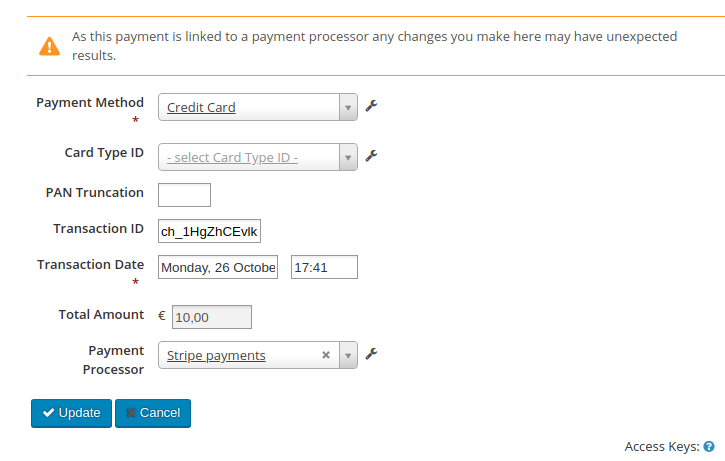

# Edit Payment Form

Replaces core edit payment form with one which allows editing payments linked to payment processors.

This provides an easy way for a site admin to correct payment data using the UI as and when they
find it, without resorting to API or database level interaction.

## Requirements

* PHP v7.2+
* CiviCRM 5.30+
* https://github.com/civicrm/civicrm-core/pull/18917 (merged in CiviCRM 5.32).

## Installation

Only install this extension if recommended to do so. It overrides a core form and may not work on different versions of CiviCRM.

## Usage

Install and open the "Edit payment" form. You'll be able to select the payment processor and that information will be saved when updating the payment.

## Support and Maintenance
This extension is supported and maintained with the help and support of the CiviCRM community by:

We offer paid [support and development](https://mjw.pt/support) as well as a [troubleshooting/investigation service](https://mjw.pt/investigation).
